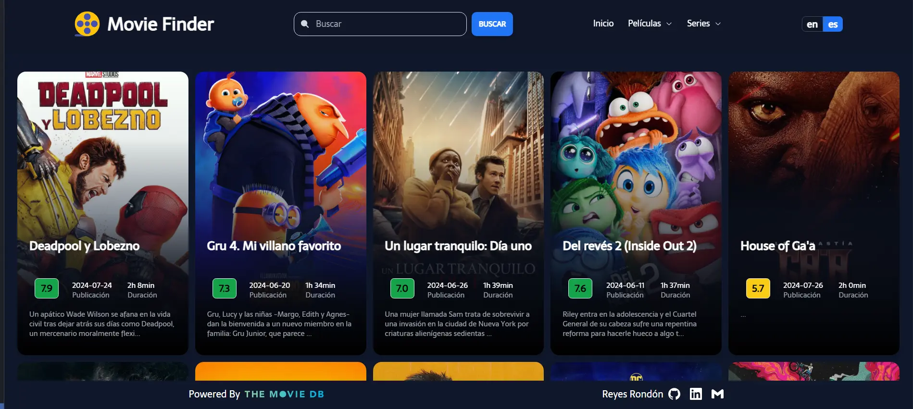

[](https://github.com/Reyes1921/movie-finder/blob/main/README.md)
[](https://github.com/Reyes1921/movie-finder/blob/main/README.es.md)

# Movie Finder

Aplicación para ver información sobre películas y series de todo el mundo utilizando la increíble API de The Movie Database (TMDB). Echa un vistazo [movie-finder](https://movie-finder-3000.netlify.app/)

## ⚙️ Funcionalidades

- Conoce las películas y series del momento

- Conocer a los actores y actrices del momento

- Conocer las producciones que hay detrás de cada película y proyecto televisivo

## 👨‍💻 Tecnologías utilizadas

- [**React 18**](https://react.dev/) - La biblioteca para interfaces de usuario nativas y web.
- [**Tailwindcss**](https://tailwindcss.com/) - Framework de CSS para el diseño de páginas web.
- [**The Movie Database (TMDB) API**](https://www.themoviedb.org/) - Aquí encontrará la lista definitiva de métodos disponibles actualmente para nuestra API de películas, televisión, actores e imágenes.
- [**Prettier**](https://prettier.io/) + [prettier-plugin-tailwindcss](https://github.com/tailwindlabs/prettier-plugin-tailwindcss) - Formateador CSS.
- [**i18next 23.12.2**](https://react.i18next.com/) - Marco de internacionalización para React / React Native.
- [**react-router-dom 6.23**](https://reactrouter.com/en/main) - Permite el "enrutamiento del lado del cliente".
- [**Axios ^1.6.8**](https://axios-http.com/) - Un sencillo cliente HTTP basado en promesas para el navegador y node.js.
- [**Swiperjs**](https://swiperjs.com/) - El deslizador táctil móvil más moderno.
- [**react-infinite-scroll-component**](https://www.npmjs.com/package/react-infinite-scroll-component) - Un componente para que desaparezcan todos tus problemas de desplazamiento infinito con sólo 4,15 kB.
- [**primereact**](https://primereact.org/) - Mejore sus aplicaciones web con el completo conjunto de componentes de interfaz de usuario personalizables y repletos de funciones de PrimeReact.

## 🚀 Primeros pasos

En primer lugar, ejecute el servidor de desarrollo:

```bash
npm install
npm run dev
```

La aplicación se abre en el puerto 5173


<div align="center">


</div>

# ✉️ Contacto

- Correo electrónico: reyesjrondon@gmail.com
- [Portafolio](https://www.reyesrondon.dev/es)
- [Linkedin](https://www.linkedin.com/in/reyes-rondon/)
