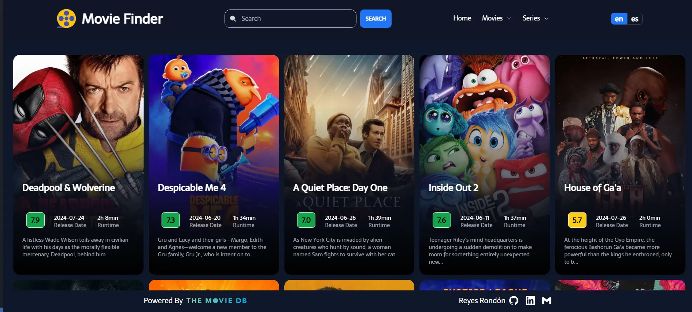

[](https://github.com/Reyes1921/movie-finder/blob/main/README.md)
[](https://github.com/Reyes1921/movie-finder/blob/main/README.es.md)

# Movie Finder

Application to view information about movies and series from all over the world using the amazing API of The Movie Database (TMDB). Take a look [movie-finder](https://movie-finder-3000.netlify.app/)

## ⚙️ Features

- Learn about the movies and series of the moment

- Learn about the actors and actresses of the moment

- To know about the productions behind each film and TV project

## 👨‍💻 Technologies used

- [**React 18**](https://react.dev/) - The library for web and native user interfaces.
- [**Tailwindcss**](https://tailwindcss.com/) - A utility-first CSS framework.
- [**The Movie Database (TMDB) API**](https://www.themoviedb.org/) - This is where you will find the definitive list of currently available methods for our movie, tv, actor and image API.
- [**Prettier**](https://prettier.io/) + [prettier-plugin-tailwindcss](https://github.com/tailwindlabs/prettier-plugin-tailwindcss) - CSS formatter.
- [**i18next 23.12.2**](https://react.i18next.com/) - Internationalization framework for React / React Native.
- [**react-router-dom 6.23**](https://reactrouter.com/en/main) - A React Router enables "client side routing".
- [**Axios ^1.6.8**](https://axios-http.com/) - A simple promise based HTTP client for the browser and node.js.
- [**Swiperjs**](https://swiperjs.com/) - The Most Modern Mobile Touch Slider.
- [**react-infinite-scroll-component**](https://www.npmjs.com/package/react-infinite-scroll-component) - A component to make all your infinite scrolling woes go away with just 4.15 kB!.
- [**primereact**](https://primereact.org/) - Elevate your web applications with PrimeReact's comprehensive suite of customizable, feature-rich UI components.

## 🚀 Getting Started

First, run the development server:

```bash
npm install
npm run dev
```

Application opens on port 3000


<div align="center">


</div>

# ✉️ Contact

- E-mail address: reyesjrondon@gmail.com
- [Portfolio](https://www.reyesrondon.dev/en)
- [Linkedin](https://www.linkedin.com/in/reyes-rondon/?locale=en_US)
